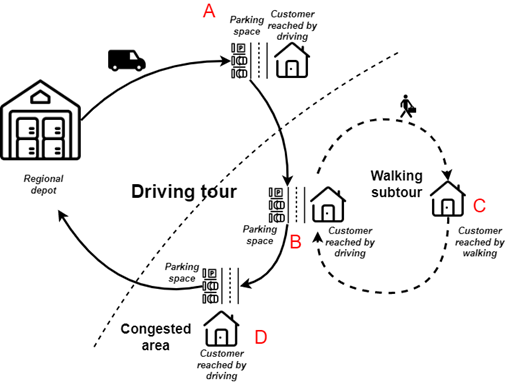
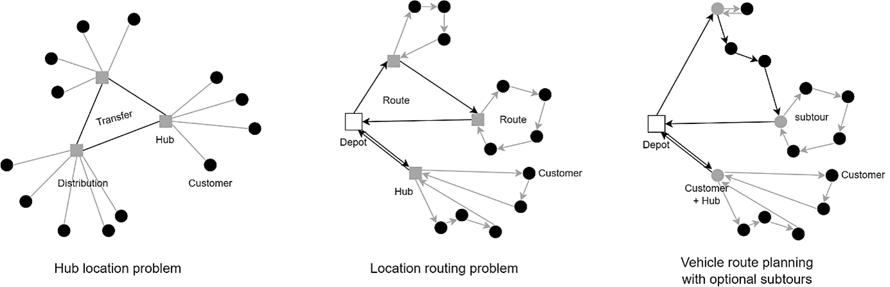
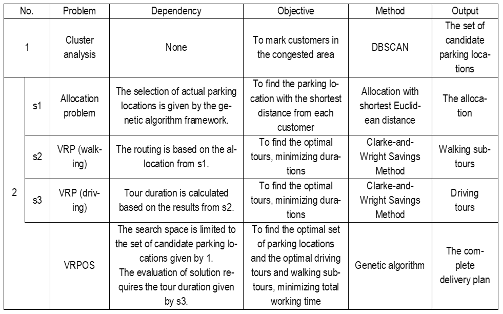
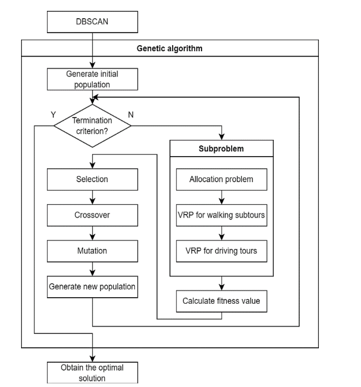

# VRPOS
This repository contains the source code for my project, focusing on VRPOS (Vehicle Routing Problem with Optinal Subtours) and mini-hub system.
 * Delivery mode

 * Definition of VRPOS

 * Hierarchy

 * Solution of VRPOS

